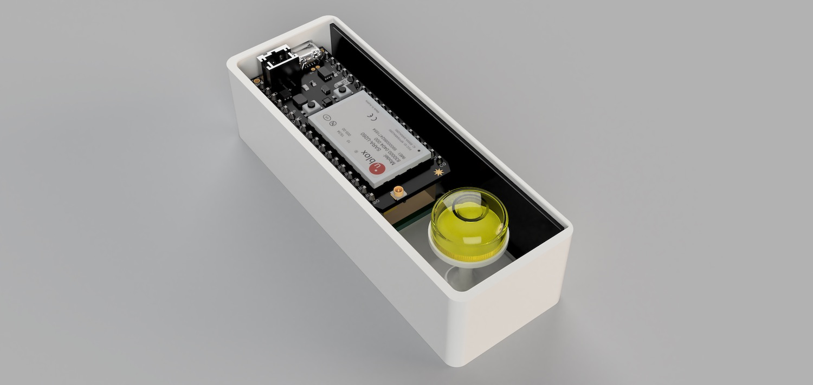
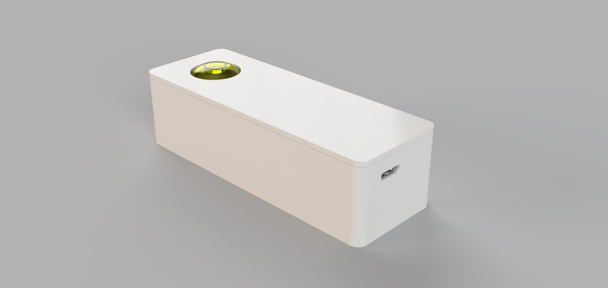
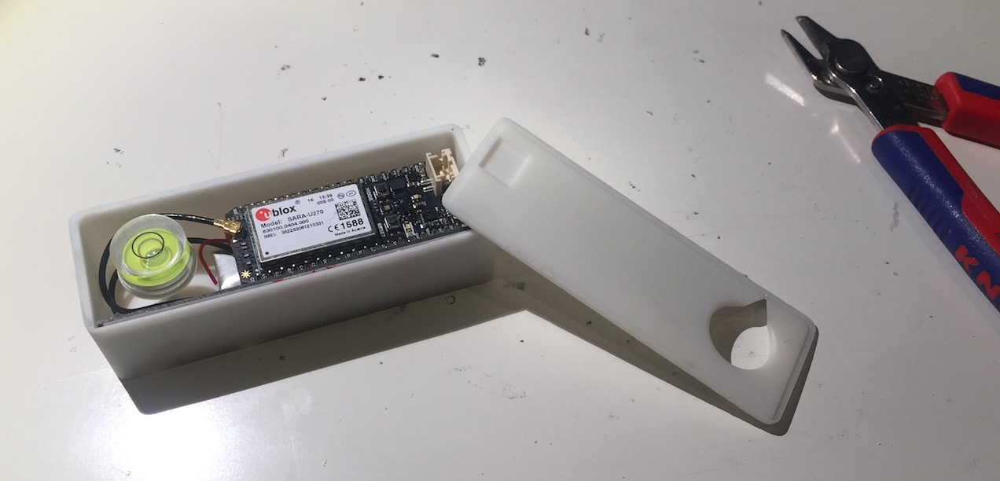

# liftsensor

Measures acceleration to find out if an elevator works and updates its status on [accessibility.cloud](https://www.accessibility.cloud).

## Design / photos

This is how the sensor looks:

## Technical specification

- Plug & Play installation using the maintenance 230V AC connector on top of the elevator's cabin
- Typical power consumption <1W, micro USB power adapter
- Sets the elevator's status to 'unknown' if it has not been in use within typical usage time intervals
- M2M Nano SIM card leverages a comprehensive network of carriers to provide service in over 100 countries out of the box
- Built-in 150mA battery to actively send maintenance events in case the device is unplugged
- Open source design based on [Particle Electron](https://docs.particle.io/datasheets/electron-(cellular)/electron-datasheet/) IoT platform
- Analog Devices ADXL335 3-Axis ±3 g acceleration sensor
- U-blox SARA-U260/U270 3G module for communication with [accessibility.cloud](https://www.accessibility.cloud)
- STM32F205RGT6 120MHz ARM Cortex M3 microcontroller
- 1MB flash, 128KB RAM
- Allows firmware updates over-the-air
- RGB status LED
- Real-time operation system (RTOS)
